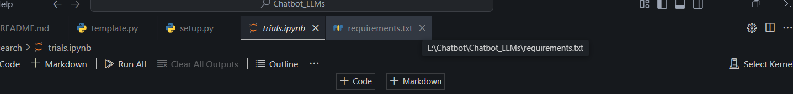

  -> nhớ chọn venv -> slect kernel
anaconda prompt
```

conda create -n medichatbot python=3.10 -y


conda activate medichatbot


pip install -r requirements.txt

python template.py

---

add -e .  ---in--> requirements.txt


-e . là viết tắt của --editable ., có nghĩa là cài đặt package hiện tại (trong thư mục chứa file requirements.txt) ở chế độ "editable mode" (chế độ có thể chỉnh sửa).

Cụ thể:

Dấu . đại diện cho thư mục hiện tại

Khi bạn chạy pip install -e ., pip sẽ tìm file setup.py hoặc pyproject.toml trong thư mục hiện tại và cài đặt package đó ở chế độ editable

Trong chế độ này, các thay đổi bạn thực hiện trên code sẽ có hiệu lực ngay lập tức mà không cần phải cài đặt lại package


conda activate medichatbot -> kích hoạt venv trc


pip install -r requirements.txt


``` 
--- Anaconda prompt


 


```

Giải thích một số gói cài trong requirements

```
 2. pinecone[grpc]

Pinecone là dịch vụ vector database để lưu trữ và tìm kiếm các vector embedding (dùng cho tìm kiếm ngữ nghĩa).

[grpc] nghĩa là cài thêm gói hỗ trợ giao tiếp nhanh qua gRPC (Google Remote Procedure Call).

Dùng Pinecone khi bạn muốn tìm kiếm nhanh các văn bản tương tự trong kho dữ liệu lớn.

✅ 3. langchain-pinecone

Đây là plugin tích hợp Pinecone với LangChain.

Nó giúp bạn quản lý vector database Pinecone trong flow của LangChain dễ dàng hơn (ví dụ: lưu trữ embedding, tìm kiếm khi người dùng chat).

✅ 4. langchain_community

Đây là module của LangChain chứa các tích hợp cộng đồng đóng góp (ví dụ: các loader, retriever hoặc API kết nối).

Trong LangChain >= 0.1.0, một số phần được tách ra thành langchain_community để gọn hơn.

✅ 5. langchain_openai

Module này giúp bạn kết nối LangChain với API OpenAI (GPT-3.5, GPT-4).

Bạn chỉ cần cung cấp API key là dùng được ChatGPT hoặc các model embedding của OpenAI ngay trong pipeline LangChain.

✅ 6. langchain_experimental

Đây là module thử nghiệm của LangChain chứa những tính năng chưa ổn định hoặc mới phát triển (ví dụ: AutoGPT, memory cải tiến, …).

Dùng cẩn thận vì API có thể thay đổi hoặc bị xoá trong các bản cập nhật mới.
```


Note

```
Đúng rồi 👍. sentence-transformers (hay sentence_transformers) là một thư viện dựa trên Transformers giúp encode cả câu/tham chiếu văn bản thành vector (embedding) để có thể:

✅ So sánh mức độ giống nhau về ngữ nghĩa giữa hai câu (semantic similarity).
✅ Tìm câu trả lời gần giống nhất với câu hỏi (use case: search, QA, chatbot).
✅ Làm clustering, search trong cơ sở dữ liệu văn bản (vector search).

Ví dụ: nếu bạn hỏi “Trái đất quay quanh gì?” và trong data có câu “Hành tinh quay quanh mặt trời”, model có thể encode cả 2 câu rồi tìm câu gần nghĩa nhất nhờ tính toán cosine similarity giữa 2 vector.

🌟 Ngoài sentence-transformers, các model transformers phổ biến khác gồm:
🟣 1. Text-to-Text Models (chuyển đổi văn bản thành văn bản khác)
T5 (Text-to-Text Transfer Transformer): làm đủ thứ từ dịch, tóm tắt, trả lời câu hỏi.

FLAN-T5: phiên bản T5 đã được fine-tune với nhiều tác vụ hơn, rất mạnh cho QA.

BART: mạnh về tóm tắt văn bản và sinh câu.

🟣 2. Encoder Models (biểu diễn tốt cho embedding)
BERT (Bidirectional Encoder Representations from Transformers):

Mạnh trong hiểu ngữ nghĩa (NLP tasks như classification, NER).

Dùng để encode câu, đoạn văn.

DistilBERT: phiên bản nhỏ gọn hơn của BERT.

RoBERTa: cải tiến training của BERT.

ALBERT: BERT tối ưu hơn (ít tham số hơn).

🟣 3. Decoder Models (mạnh về sinh văn bản)
GPT-2, GPT-3, GPT-4: sinh văn bản, chat, dịch.

OPT, BLOOM: mã nguồn mở tương tự GPT.

🟣 4. Multilingual Models (đa ngôn ngữ)
mBERT: BERT hỗ trợ đa ngôn ngữ.

XLM-R (XLM-RoBERTa): rất mạnh cho đa ngôn ngữ.

LaBSE (Language-agnostic BERT Sentence Embedding): encode câu tiếng Việt, Anh, Nhật… vào cùng 1 không gian vector để so sánh.

✅ Tóm gọn:

sentence-transformers = dùng Encoder (BERT/RoBERTa) để embedding câu → tìm câu gần nghĩa nhất.

GPT/BART = dùng Decoder → sinh câu trả lời trực tiếp.

T5 = vừa Encoder + Decoder → encode + sinh văn bản.
```